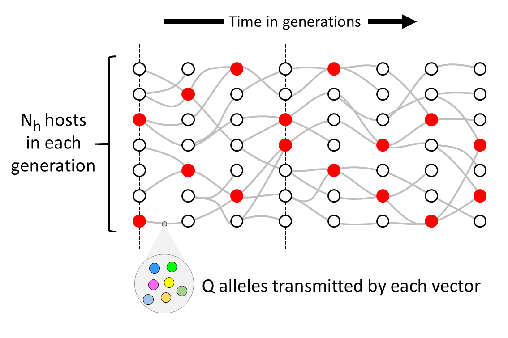

# The basic model

Our basic model is an idealised form of the [genomic transmission graph](transmission-graph.md).  We make the simplifying assumption that parasites are transmitted from host to host in non-overlapping generations. 

In each generation there are $N_h$ hosts. Each vector transmits $Q$ alleles to the recipient host.  $\chi$ is the proportion of hosts that are superinfected, denoted in the figure by red nodes.

We call $N_h$ the **effective number of hosts**.  We can think of this as the number of hosts that are in effect responsible for transmitting parasites from one generation to the next, which is likely to be much less than the total number of infected individuals, and represents a major population bottleneck.

We call $Q$ the **quantum of transmission**.  We can think of this as the number of parasites that are inoculated by a mosquito into the host, but this is an over-simplification because $Q$ summarises a complex series of bottlenecks in host-vector and vector-host transmission occuring during one generation of the parasite life-cycle.

We call $\chi$ the **crossing rate of transmission chains** but it can also be viewed as the proportion of hosts that are superinfected.  In our model, a host can have either one or two sources of infection in the previous generation, i.e. they are either superinfected or not.

We can use this model to estimate

- [Time to coalescence](coalescence-time-basic.ipynb)
- [Nucleotide diversity](nucleotide-diversity.ipynb)
- [Haplotype homozygosity](haplotype-homozygosity-2cM.ipynb)
- [Effects of migration](migration-simple.ipynb)
- [Rates of superinfection](fws-compare-methods.ipynb)