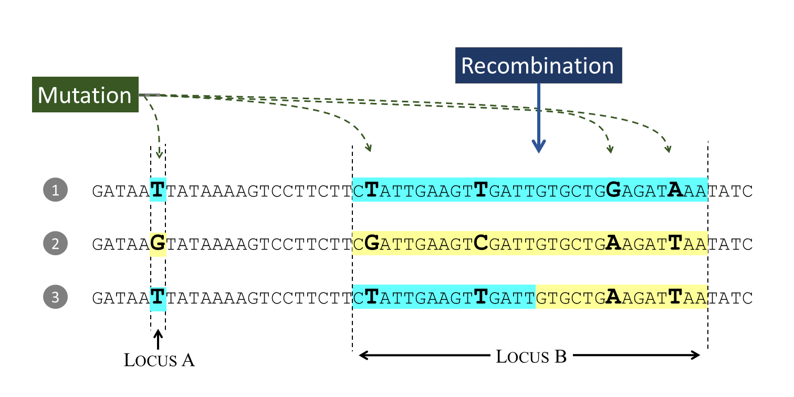
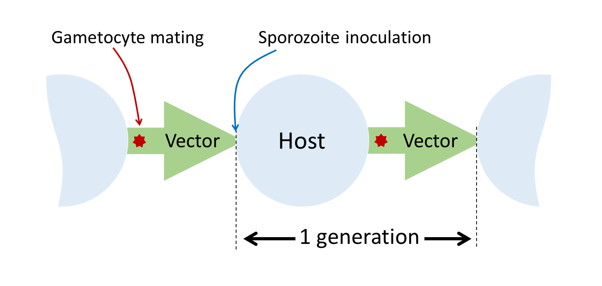

# Glossary

This glossary explains the terminology used on this website, which sometimes differs from common usage, or is a specific interpretation of it. 

**Allele.**  An instance of the parasite genome.  For example, *n* haploid individuals correspond to *n* alleles.  We often speak of an allele with reference to a particular locus, in which case it means the DNA sequence of that locus in an individual parasite genome.  

**Coalescence.**  If two lineages are traced back in time, coalescence occurs when they meet in the same ancestral allele.

**Cotransmission.**  Transmission from one host to another of a mixture of parasite alleles with different ancestral histories.

**Crossing rate of transmission chains ($\chi$).** The proportion of hosts that acquire parasites from more than one transmission chain, i.e. from more than one host in the previous generation.  This is equivalent to proportion of hosts that are superinfected.

**Effective number of hosts ($N_h$).**  The number of hosts that effectively transmit parasites in each generation of the transmission graph.  This is a form of population bottleneck. 

**Effective recombination.**  Recombination between genetically distinct alleles that acts to change the DNA sequence of a haplotype locus.

**Effective recombination parameter ($\phi_t$).**  The probability that, if recombination occurs at a locus at time *t*, this will change the DNA sequence of the locus.

**Haplotype.**  A specific DNA sequence observed at a haplotype locus.  At a large haplotype locus there will typically be many different haplotypes.

**Haplotype locus.** A locus that extends over multiple nucleotide positions and that can therefore undergo recombination. 

[See figure caption](locus.md)

**Heterozygosity (*H*).** The probability that two alleles sampled randomly from some population are heterozygous, i.e. that they have different DNA sequences. 

**Homozygosity (*G*).** The probability that two alleles sampled randomly from some population are homozygous, i.e. that they have the same DNA sequence.

**Host.**  A person that is carrying parasites and capable of transmitting them to others.  Each host exists for a single generation of the genomic transmission graph.  

**Lineage.** A path that traces the ancestry of an allele at a point locus, going backwards in time through the transmission graph.  A point locus is not affected by recombination, so a lineage can be traced back over many generations despite frequent recombination events.

**Locus.**  A specific location in the genome.  This can be either a single nucleotide position (a point locus) or a sequence extending over multiple nucleotide positions (a haplotype locus).

**Nucleotide diversity ($\pi$).** The probability that two alleles are heterozygous at a random nucleotide position in the genome.

**Parasite.**  A malaria parasite of the species *Plasmodium falciparum* that is transmitted from host to host by a mosquito vector.  It is a single-celled organism that is haploid for most of its lifecycle.  It reproduces asexually apart from a brief phase of sexual reproduction within the vector. 

[See figure caption](generation.md)

**Point locus.** A specific single nucleotide position in the genome. 

**Polymorphism.** Variation in the DNA sequence at some specified locus.

**Quantum of transmission ($Q$).** The number of parasite alleles transmitted from one host to the next via a vector.  $Q$ summarises a complex series of bottlenecks in host-vector and vector-host transmission occuring during one generation of the parasite life-cycle.

**Single nucleotide polymorphism (SNP).**  A polymorphism that involves only a single nucleotide position.  It usually arises from a type of mutation called a single nucleotide substitution.

**Superinfection.** Infection of a host with parasites from more than one source in the previous generation.  In the genomic transmission graph this is equivalent to crossing of transmission chains.

**Transmission bottleneck.**  A population bottleneck that affects the number of alleles that are passed from one generation of the genomic transmission graph to the next.  From the perspective of the parasite population as a whole, the quantum of transmission $Q$ and the effective number of hosts $N_h$ can both be considered as transmission bottlenecks.

**Transmission chain.** A sequence of host-to-host transmission events.   If we pick any node in the transmission graph, and trace a path forward in time along the edges to another node, that is a transmission chain.

**Vector.**  An *Anopheles* mosquito that transmits malaria parasites from one host to another.