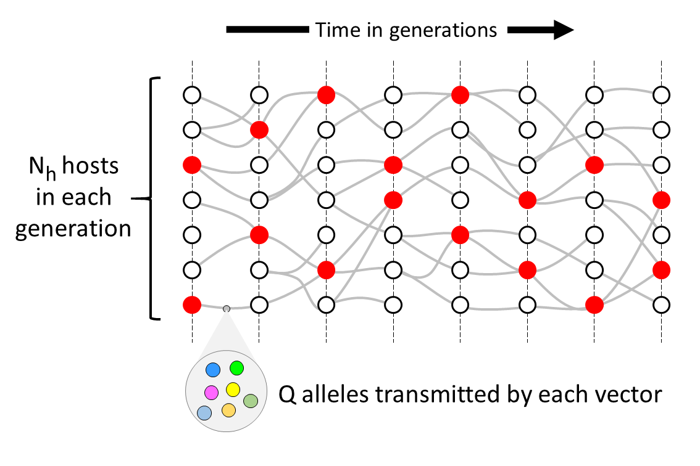

# Structure of the genomic transmission graph

Our idealised model imagines non-overlapping cycles of host to host transmission, and we refer to each cycle as a generation of the transmission graph. 

[See figure caption](idealised-tg.md)

- There are $N_h$ hosts in each generation of the transmission graph: we refer to this as the \textbf{effective number of hosts}.  We can think of $N_h$ as the number of hosts that are in effect responsible for transmitting parasites from one generation to the next, which is likely to be much less than the total number of infected individuals, and represents a major population bottleneck.  The source of infection of a host is determined by random sampling with replacement from the $N_h$ hosts in the previous generation.

- Each vector transmits $Q$ alleles to the recipient host: we call this the \textbf{quantum of transmission}.  We can think of $Q$ as the number of parasites that are inoculated by a mosquito into the host, but this is an over-simplification because $Q$ summarises a complex series of bottlenecks in host-vector and vector-host transmission occuring during one generation of the parasite life-cycle \cite{Chan2013,Graumans2020}.  The alleles transmitted to the recipient host are copied by random sampling with replacement from the alleles carried by the source host.

- Each host has either one or two sources of infection in the previous generation, i.e. they are either superinfected or not.  The proportion of hosts that are superinfected is denoted $\chi$.  From the perspective of the genomic transmission graph, we refer to $\chi$ as the \textbf{crossing rate of transmission chains}. 
