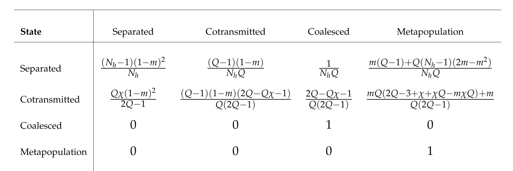

# Transition probabilities for the four possible states of two lineages within a subpopulation. 

At any point in time, two lineages must be (1) separated within the subpopulation or (2) cotransmitted within the subpopulation or (3) coalesced within the subpopulation or (4) entered the metapopulation. *m* is the probability that a host within the local subpopulation acquired their infection from the metapopulation.  If the metapopulation is much larger than the subpopulation then we can treat it as an absorbing state. Row *i* column *j* of the table gives the probability that lineages in state *i* will transition to state *j* if we go back a single generation.

[Return to Effects of Migration](https://d-kwiat.github.io/gtg/migration-simple.html)