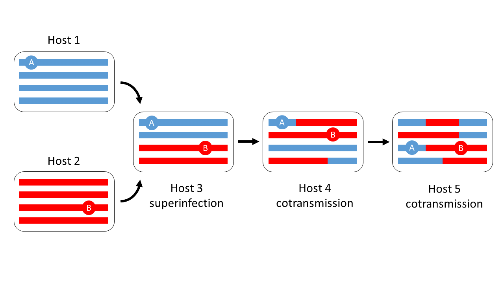

# Superinfection leads to cotransmission and recombination of distinct lineages

.

Coloured bars represent parasite genomes within a host.  Here we imagine that hosts 1 and 2 each carry a clonal population of parasites, and that the two clonal populations can be differentiated by genotyping, represented by blue and red respectively.  Host 3 is superinfected and carries a mixture of the two genotypes.  The two genotypes recombine when this mixture is cotransmitted from host 3 to host 4, and there is further recombination when the mixture is cotransmitted from host 4 to host 5.  The circles marked A and B represent two different loci in a parasite genome carried by host 5: locus A is inherited from host 1 whereas locus B is inherited from host 2.  Thus it is not possible to represent this parasite population by a single phlyogenetic tree - because the red/blue recombinant genomes cannot be mapped onto a single position on the tree.