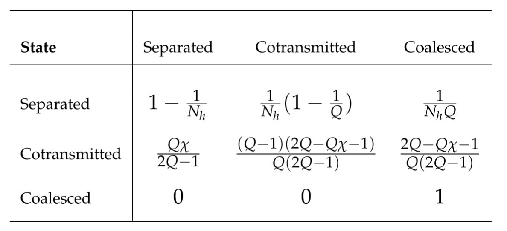

### Transition probabilities for the three possible states of two lineages. 

At any point in time, two lineages must be (1) separated or (2) cotransmitted or (3) coalesced. Row *i* column *j* of the table gives
the probability that lineages in state *i* will transition to state *j* if we go back a single generation. By definition, the probabilities in each row sum to 1.

[Return to Time to Coalescence](coalescence-time-basic.ipynb)