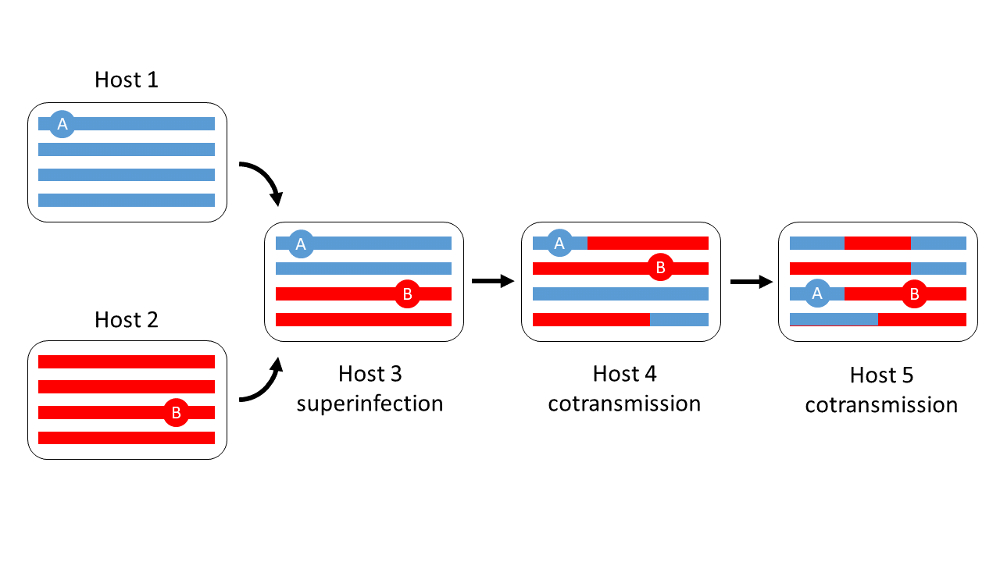

# Underlying concepts

Imagine a directed acyclic graph in which the nodes represent hosts and edges represent vectors, as illustrated below in figure \ref{fig:main_graph_1}. The graph is plotted on an axis of time and we make the simplifying assumption that a host exists at a discrete point in time. We call this the genomic transmission graph.

If we pick any node and trace a path forward in time along the edges to some other node, that is a *transmission chain*. Transmission chains can *branch* when a host is the source of parasites for multiple other hosts.  Transmission chains can also *cross* when a host acquires parasites from multiple sources, i.e when there is superinfection.

Parasites reproduce as they flow along transmission chains, and parasites that are flowing along the same transmission chain can genetically recombine with each other.

An individual parasite could have many different lineages each following a unique path through the graph.  To understand how this is possible, imagine two point loci (A and B) in a parasite's genome.  If we trace the two corresponding lineages back in time, they are obliged to follow the same transmission chain until they reach a host that is superinfected, i.e. a node in the graph at which two transmission chains cross.  At that point their paths through the graph can diverge, because in the presence of recombination it is possible for locus A to be inherited from one of the transmission chains and locus B from the other.1

.

These simple concepts suggest a logical framework for thinking about how genetic variation is related to transmission dynamics in a recombining parasite population.  Instead of attempting to construct a phylogenetic tree, we imagine a genomic transmission graph onto which we can map the lineages of different loci in the genome - we call this the genomic transmission graph.  This allows for superinfection and recombination because lineages at different loci can take different pathways through the graph.  The challenge is then to define the essential parameters of the graph and to understand how they are related to genetic variation.  

To understand the scientific concepts it is a good idea to work through the sections in this order:

1 [The basic model](basic-model.md)
1 [Time to coalescence](coalescence-time-basic.ipynb)
1 [Nucleotide diversity](nucleotide-diversity.ipynb)
1 [Haplotype homozygosity](haplotype-homozygosity-2cM.ipynb)
1 [Effect of migration](migration-simple.ipynb)
1 [Rate of superinfection](fws-compare-methods.ipynb)